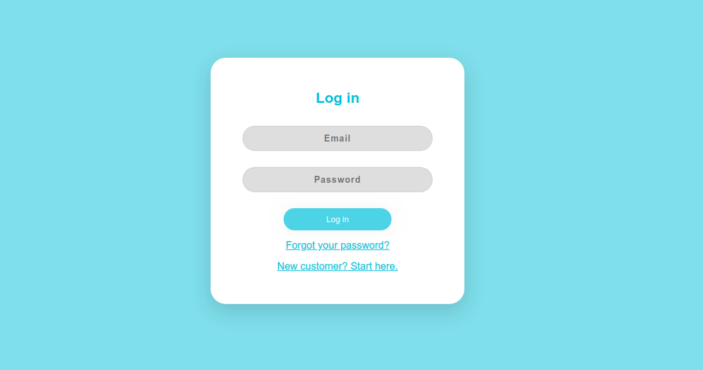
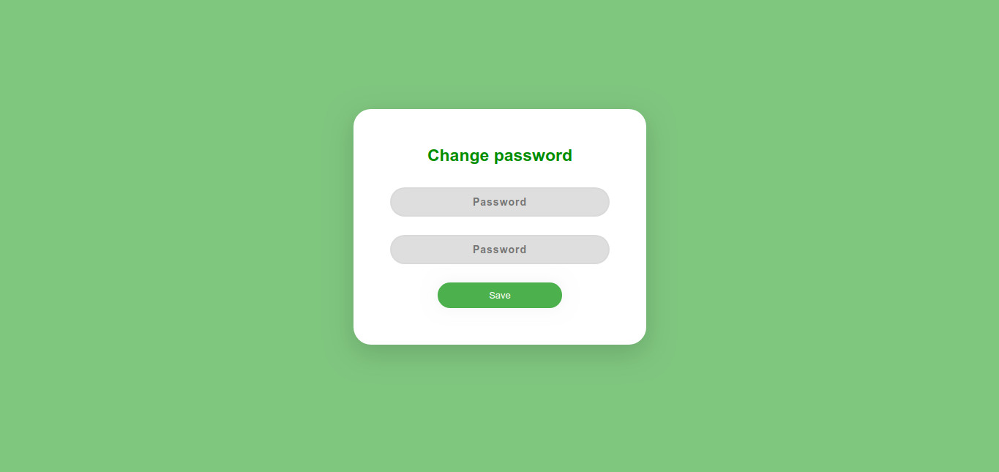
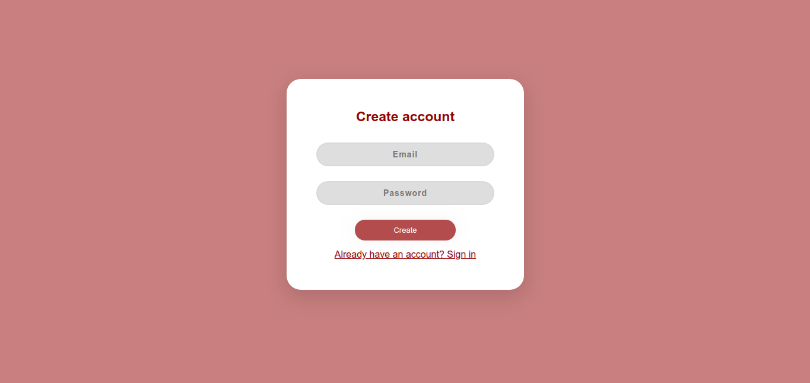
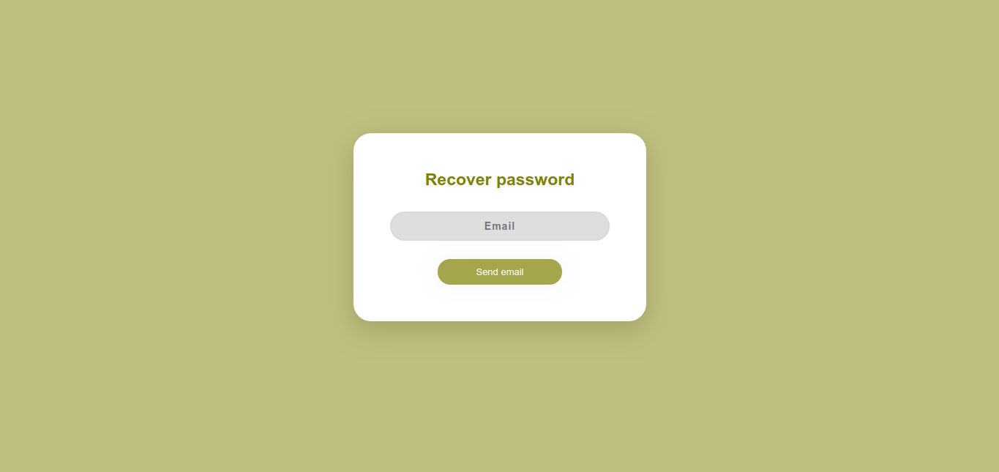

# vue-common-pages

This is a small VueJS component providing a generator of common pages.

Basically you can generate any type of simple form pages like 'Log in', 'Change Password', 'Register', 'Forgot Password'...


## Setup

First, install the dependency using `npm` or `yarn`.
```bash
npm install --save common-pages
# or with yarn
yarn add common-pages
```

Then, you have to import the component in your Vue app:

```javascript
import CommonPage from 'vue-common-pages';
```

And you'll be able to use the component!

## Using the component

```html
<common-page                                                                                                        
   :color="data.color"
   :texts="data.texts"
   :inputs="data.inputs"
   :links="data.links"
   @submit="handleForm"
/>
```

## Examples

*Screenshots examples can only be seen at https://github.com/marcos-estrela/common-pages

### Log in page


```javascript
const data = {
   color: "#00bfd8",
   texts: {
      title: "Log in",
      button: "Log in",
   },
   inputs: [
      {
            id: "email",
            type: "email",
            placeholder: "Email",
      },
      {
            id: "password",
            type: "password",
            placeholder: "Password",
      },
   ],
   links: [
      {
            id: "forgotPassword",
            text: "Forgot your password?",
            url: "#",
      },
      {
            id: "newCustomer",
            text: "New customer? Start here.",
            url: "#",
      },
   ],
};
```
<hr style="border:2px solid gray"> </hr>




```javascript
const changePasswordPage = {
    color: "#008000",
    texts: {
        title: "Change password",
        button: "Save",
    },
    inputs: [
        {
            id: "password",
            type: "password",
            placeholder: "Password",
        },
        {
            id: "passwordAgain",
            type: "password",
            placeholder: "Password",
        },
    ],
};
```
<hr style="border:2px solid gray"> </hr>




```javascript
const data = {
    color: "#8B0000",
    texts: {
        title: "Create account",
        button: "Create",  
    },
    inputs: [
        {
            id: "email",
            type: "email",
            placeholder: "Email",
        },
        {
            id: "password",
            type: "password",
            placeholder: "Password",
        },

    ],
    links: [
        {
            id: "alreadyCustomer",
            text: "Already have an account? Sign in",
            url: "#",
        },
    ],
};

```
<hr style="border:2px solid gray"> </hr>



```javascript
const data = {
    color: "#83781a",
    texts: {
        title: "Recover password",
        button: "Send email",
    },
    inputs: [
        {
            id: "email",
            type: "email",
            placeholder: "Email",
        }
    ]
};
```
<hr style="border:2px solid gray"> </hr>

<!-- ## Contribute

If you wish to contribute, or simply debug, this library, you're free to go!

Just run:

```bash
# install dependencies
yarn
# You need to add vue, as its a peer dependency
yarn add vue
# Run the app
yarn serve
```

And go to http://localhost:8080 to see the demo app.

The rotation computation relies on the external library `ts-matrix` to compute a 360º angle between the center and the current cursor position. -->

### Issues

Feel free to open an issue on the github page. I'll take a look ASAP!